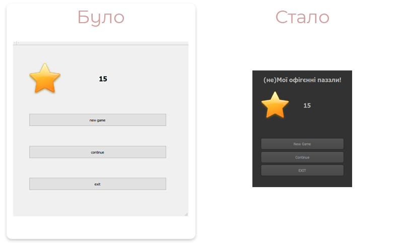
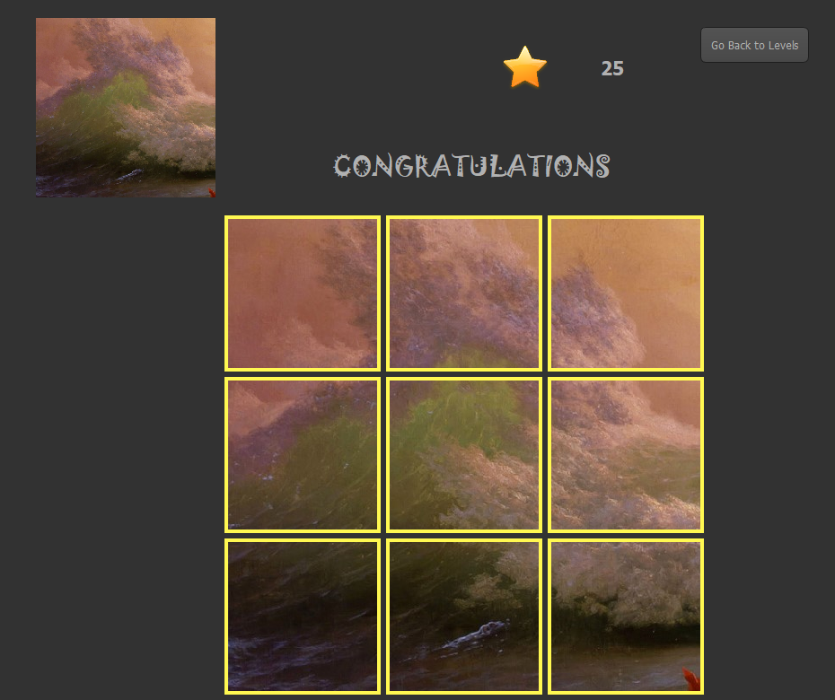

# Лабораторна 2. Рефакторинг програмного коду.

**Автор проєкту:** Анонімний студент ФКНК Київського національного університету ім. Тараса Шевченка.

**Опис проєкту:** Додаток для систем Windows 7+ який дозволяє користувачеві пройти 5 рівнів складання пазлів різної складності, а також дозволяє завантажувати своє зображення для гри у пазл з ним.

**Рефакторинг виконав:** Точаненко Владислав

[Оригінальний код додатку](https://github.com/knu-5-tochanenko/SoftwareReengineering/tree/master/Lab_1/Original).

[Код додатку із базовим рефакторингом](https://github.com/knu-5-tochanenko/SoftwareReengineering/tree/master/Lab_1/Refactored).

## Чек-ліст змін

* [x] ~~Позбавитись сінглтону~~ (Використання сінглтону виправдано, адже він зберігає налаштування для усього додатку)
* [x] 1. Виправити помилку коли при початку нової гри зберігається дата про пройдені рівні, що не дає можливість збільшуватись лічильнику зірочок (додати `users.remove("")` у групі налаштувань `QSettings`: `"puzzle1"`)
* [x] 2.1 Змінити дизайн сторінок (менше відстані між об'єктами, більші кнопки, більше кольорів, ...)
* [x] 2.2 Замінити усі строки у додатку на строки із необхідним регістром
* [x] 3. Виправити помилку при закритті поточного паззлу, коли з'являється меню налаштувань, а сторінка паззлу не зникає
* [x] 4.1 Додати зірки до екрану вибору рівня
* [x] 4.2 Додати необхідну інформацію про рівні на сторінці `levels`
* [x] 5.1 Додати затримку після того, як було успішно складено паззл
* [x] 5.2 Додати оновлювану кількість зірок після успішного складання паззлу
* [ ] Додати текст, коли було зроблено пазл у `ForPleasure` режимі
* [ ] Додати підказки до кнопок у `ForPleasure` режимі
* [ ] Пофіксити поведінку кнопок для переходу між етапами у `ForPleasure` режимі
* [ ] Виправити помилку коли при закритті додатку лише закривається UI, а процес залишається активним

## 1. Виправити помилку коли при початку нової гри зберігається дата про пройдені рівні, що не дає можливість збільшуватись лічильнику зірочок

Повні зміни у [мердж реквесті](https://github.com/knu-5-tochanenko/SoftwareReengineering/pull/6/files).

При натисканні на `New Game` з'являється помилка, адже зберігаються дані про пройдені рівні, що не дає можливості отримувати зірочки за перший рівень, що за собою робить не можливим перехід на 2 рівень. Необхідно було додати просту функцію очистки даних:

```cpp
QSettings users("Users", "puzzle1");
users.beginGroup("puzzle1");
users.remove("");
users.endGroup();
```

## 2. Змінити дизайн сторінок (менше відстані між об'єктами, більші кнопки, більше кольорів, ...); замінити усі строки у додатку на строки із необхідним регістром

Повні зміни у [мердж реквесті](https://github.com/knu-5-tochanenko/SoftwareReengineering/pull/7/files).

### **Головний екран:**



### **Екран вибору режиму:**


### **Екран вибору рівня:**


### **Екран вибору підрівня:**

Дизайн був залишений орєгінальний.


### **Екран паззлу:**


### **Екран гри "For Pleasure":**


### **Екран гри після закінчення рівня:**


### **Екран налаштувань:**


## 3. Виправити помилку при закритті поточного паззлу, коли з'являється меню налаштувань, а сторінка паззлу не зникає

Було вирішено позбутись екрану налаштувань шляхом перенесення його функціоналу на екран паззлу.

Повні зміни у [мердж реквесті](https://github.com/knu-5-tochanenko/SoftwareReengineering/pull/8/files).

## 4. Додати зірки до екрану вибору рівня; Додати необхідну інформацію про рівні на сторінці `levels`

До екрану вибору рівня були додані критерії відкриття рівнів, а також лічильник зірок:


Повні зміни у [мердж реквесті](https://github.com/knu-5-tochanenko/SoftwareReengineering/pull/9/files).

## 5. Додати затримку після того, як було успішно складено паззл; Додати оновлювану кількість зірок після успішного складання паззлу

Було пофікшено відображення тексту "Congratulations" і додано відображення зірок.



Повні зміни у [мердж реквесті](https://github.com/knu-5-tochanenko/SoftwareReengineering/pull/10/files).